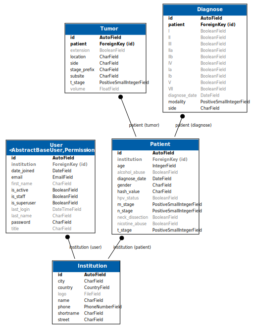

======================
Patient Representation
======================

The diagram below probably visualizes best how we set up the patient in the
database.

The exact implementation in terms of Django models and how they are created,
edited, deleted and inspected using Forms and Views is documented in the next
few sections.

.. toctree::
    :maxdepth: 2

    patients/models
    patients/views
    patients/forms
    patients/filters
    patients/ioports
    patients/mixins
